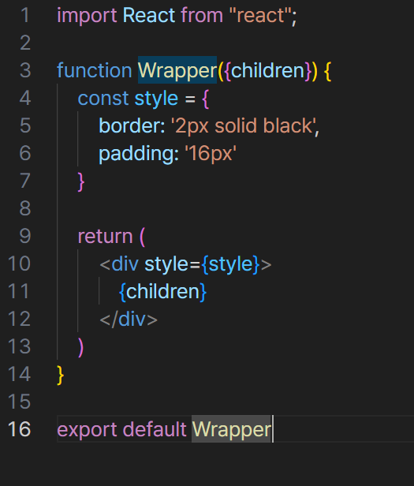
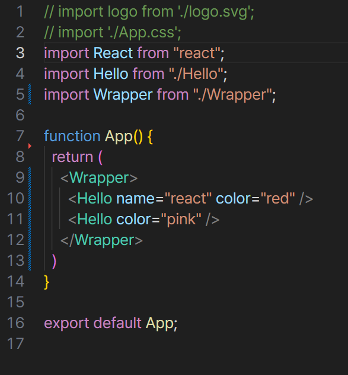

## 5. props를 통해 컴포넌트에게 값 전달하기

이번에는 컴포넌트의 props 라는 개념에 대해서 알아보자. props 는 properties(속성) 의 줄임말이다.
우리가 어떠한 값을 컴포넌트에게 전달해줘야 할 때, props 를 사용합니다.

App.js 와 Hello.jsx 파일로 이동해서 props로 name="raect" 를 넣는 실습을 진행해보자.

<br/>
<br/>

## 여러개의 props, 비구조화 할당

```
function Hello(props) {
    return <div style={{color: props.color}}>안녕하세요 {props.name}</div>
}
```
props 내부의 값을 조회할 때마다 props. 을 입력하고 있는데, 함수의 파라미터에서 비구조화 할당 (구조 분해 할당) 문법을 사용하면
조금 더 코드를 간결하게 작성할 수 있다.
```
function Hello({color, name}) {
    return <div style={{color}}>안녕하세요 {name}</div>
}
```
이런 식으로 파라미터 부분에 코드블럭을 만들어주고 여러개의 props 를 적어주면 된다.

<br/>
<br/>

## defaultProps 로 기본값 설정
컴포넌트에 props 를 지정하지 않았을 때, 기본적으로 사용할 값을 설정하고 싶다면 컴포넌트에 defaultProps 라는 값을 설정하면 된다.
```
Hello.defaultProps = {
    name: '이름없음'
}
```
이런 식으로 컴포넌트 밑에, export 해주기 전에 기본값을 설정해주면, 속성 값중 name 을 받지 않았다면 name 이 '이름없음' 이라는 기본값으로 설정이 된다.

<br/>
<br/>

## props.children
컴포넌트 태그 사이에 넣은 값을 조회하고 싶을 댄, props.children 을 조회하면 된다.
이번에, props.children 을 사용하는 새로운 컴포넌트를 만들어보자. src 안에 Wrapper.jsx 파일을 생성해보자.

이렇게 Wrapper 컴포넌트를 만들어서 App.js 로 가서 앞에 만들었던 태그들을 Wrapper 컴포넌트로 감싸주면 전에 만들었던 컴포넌트들은 브라우저에 보이지 않게 된다.
내부에 내용이 보여지게 하기 위해서는 Wrapper 에 props.children 을 랜더링해주어야 한다.

> Wrapper 컴포넌트에서 div 태그를 반환하는데, 이 태그 사이에 {children} 을 기재해주고, 컴포넌트 파라미터로 {children} 을 넣어주면 전에 만들었던 컴포넌트들이 화면에 보이는 것을 확인 가능하다.

> 이렇게 내부의 내용이 보여지게 하기 위해서는 Wrapper 에서 props.children 을 랜더링해주어야 한다.


