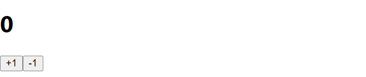

## 7. useState 를 통해 컴포넌트에서 바뀌는 값 관리하기

이번에는 컴포넌트에서 보여줘야 하는 내용이 사용자 인터렉션에 따라 바뀌어야 할 때 어떻게 구현할 수 있는지에 대하여 알아보자.

Hooks 라는 기능으로 함수형 컴포넌트에서 **상태**를 관리할 수 있다.
**useState()**라는 함수를 사용해서 상태를 관리해보자.

버튼을 누르면 숫자가 바뀌는 Counter 컴포넌트를 만들어보자. -> src폴더 안에 **Counter.jsx** 파일을 만들어서 진행해보자.
```
function Counter() {
    return (
        <div>
            <h1>0</h1>
            <button>+1</button>
            <button>-1</button>
        </div>
    )
}
```
코드를 작성해주고 **App.js**로 이동해서 Counter 컴포넌트를 랜더링 해주자.
```
function App() {
  return (
    <Counter />
  )
}
```


<br/>
<br/>

### 이벤트 설정
이제, Counter 에서 버튼이 클릭되는 이벤트가 발생 했을 때, 틀정 함수가 호출되도록 설정을 해보자.
Counter 컴포넌트를 다음과 같이 수정해보자.
```
function Counter() {
    const onIncrease = () => {
        console.log('+1')
    }

    const onDecrease = () => {
        console.log('-1')
    }

    return (
        <div>
            <h1>0</h1>
            <button onClick={onIncrease}>+1</button>
            <button onClick={onDecrease}>-1</button>
        </div>
    )
}
```
이렇게 함수를 만들고, 버튼의 onClick 으로 각 함수를 연결해줬다. 리액트에서 엘리먼트에 **이벤트**를 설정해줄 때는

>(on이벤트이름={실행하고 싶은 함수}) 형태로 설정해주면 된다.

여기서 주의해야할 점은, 함수 명을 넣어줘야하지, 밑에 코드와 같이 함수를 실행시키면 안된다
```
onClick={onIncrease()}
```
이와 같이 작성해주면 안된다  -->  **함수명**만을 넣어줘야 한다. <br/>
이와 같이 작성해주면 랜더링되는 시점에서 함수가 호출되버리기 때문이다.

<br/>
<br/>

### 동적인 값 끼얹기, useState
컴포넌트에서는 동적인 값을 상태 **(state)** 라고 부른다. 리액트에 **useState**라는 함수가 있는데, 이것을 사용하면 컴포넌트에서 상태를 관리할 수 있다.
Counter 컴포넌트를 다음과 같이 수정해보자.
```
import React, { useState } from "react";

function Counter() {
    const [number, setNumber] = useState(0)

    const onIncrease = () => {
        setNumber(number+1)
    }

    const onDecrease = () => {
        setNumber(number-1)
    }

    return (
        <div>
            <h1>{number}</h1>
            <button onClick={onIncrease}>+1</button>
            <button onClick={onDecrease}>-1</button>
        </div>
    )
}
```
```
import React, { useState } from "react";
```
제일 상단에 있는 이 코드는 리액트 패키지에서 **useState**라는 함수를 불러와준다. 밑에 코드를 적으면 자동으로 상단에 완성되는 것을 확인할 수 있다.
```
const [number, setNumber] = useState(0)
```
**useState**를 사용할 때는 상태의 기본값을 파라미터로 넣어서 호출해준다. 이 함수를 호출해주면 배열이 반환되는데,
여기서 첫번째 요소는 ***현재상태***, 두번째 요소는 ***Setter 함수***이다.

원래라면 이와 같이 작성해줘야 하지만,
```
const numberState = useState(0);
const number = numberState[0];
const setNumber = numberState[1];
```
***배열 비구조화 할당***을 통하여 각 원소를 추출해준 것이다.
```
const onIncrease = () => {
    setNumber(number + 1);
}

const onDecrease = () => {
    setNumber(number - 1);
}
```
***Setter 함수***는 파라미터로 전달 받은 값을 최신 상태로 설정해준다.
```
<h1>{number}</h1>
```
h1 태그에서는 이제 0이 아닌 ***{number}*** 값을 보여주어야 한다.
코드를 다 수정한 후에, 버튼들을 눌러보면 브라우저에서 숫자가 바뀌는 것알 확인 가능하다 --> 상태가 바뀌는 것이다.

<br/>
<br/>

### 함수형 업데이트
지금은 Setter 함수를 사용할 때, 업데이트 하고 싶은 새로운 값을 파라미터로 넣어주고 있는데,
그 대신에 기존 값을 어떻게 업데이트 할지에 대한 함수를 등록하는 방식으로도 값을 업데이트 할 수 있다.
Counter 컴포넌트의 onIncrease, onDecrease 함수를 밑의 코드와 같이 수정해보자.
```
const onIncrease = () => {
    setNumber(prevNumber => prevNumber + 1)
}

const onDecrease = () => {
    setNumber(prevNumber => prevNumber - 1)
}
```
> 여기서 `prevNumber => prevNumber - 1` 에 대해서 잘 모르겠다  -->  질문하기 !!

<br/>
<br/>

onIncrease 와 onDecrease 에서 setNumber 를 사용할 때, 그 다음 상태를 파라미터로 넣어준 것이 아니라,
값을 업데이트하는 함수를 파라미터로 넣어주었다.

함수형 업데이트는 주로 나중에 컴포넌트를 최적화 하게 될 때 사용하게 된다. 이것은 나중에 더 자세히 알아보도록 하자.
