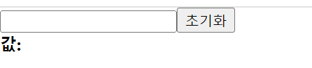
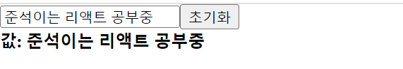

## 8. input 상태 관리하기

이번에는 리액트에서 사용자가 입력할 수 있는 **`input`** 태그의 상태를 관리하는 방법을 알아보자.
src 폴더 안에 **`InputSample.jsx`** 파일을 생성하고, 밑의 코드를 작성해보자.
```
import React from "react";

function InputSample() {
    return (
        <div>
            <input />
            <button>초기화</button>
            <div>
                <b>값: </b>
            </div>
        </div>
    )
}

export default InputSample
```
코드를 다 작성한 후에, 이 `InputSample` 컴포넌트를 App.js 에서 랜더링 해보자.
```
function App() {
  return (
    <InputSample />
  )
}
```


npm start 로 브라우저롤 확인해보면, input 에 입력하는 값이 하단에 나타나게 하고, 초기화 버튼을 누르면 input 의 값이 비워지도록 구현을 한 것이다.

<br/>

이번에도 `useState` 함수를 사용해서 컴포넌트의 상태를 바꿔보자. 이번에는 ***input*** 에 `onChange` 라는 이벤트를 사용하는데, 이벤트에 등록하는
함수에서는 이벤트 객체 ***`e`*** 를 파라미터로 받아와서 사용할 수 있는데 이 객체의 ***`e.target`*** 은 이벤트가 발생한 DOM 인 input DOM을 가르키게된다.

<br/>

이 DOM 의 `value` 값, 즉 `e.target.value` 를 조회하면 현재 input 에 입력한 값을 `useState` 를 통해서 관리를 해주면 된다.
```
function InputSample() {
    const [text, setText] = useState('')

    function onChange(e) {
        setText(e.target.value)
    }

    function onReset() {
        setText('')
    }

    return (
        <div>
            <input onChange={onChange} value={text}/>
            <button onClick={onReset}>초기화</button>
            <div>
                <b>값: {text}</b>
            </div>
        </div>
    )
}
```
`input` 의 상태를 관리할 때는 input 태그의 `value` 값도 설정해주는 것이 중요하다. 그렇게 해야, 상태가 바뀌었을 때 input 의 내용도 업데이트 된다.

