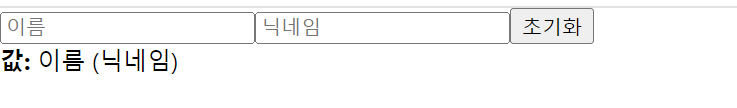
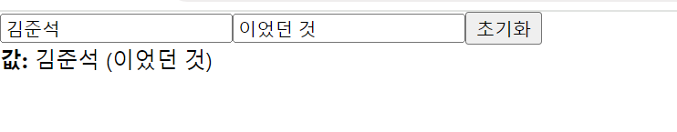

## 9. 여러개의 input 상태 관리하기

8번째 실습에서는 input 상태를 관리하는 방법에 대해 알아보았다. 이번에는 input 이 여러개일 때는 어떻게 관리해야하는지 알아보자.

8번째 실습에서 만든 `InputSample` 에서 새로운 input 을 만들어보자.

<br/>

이번에는 input 이 비워져있을 때 input 에 대한 설명을 보여주는 `placeholder` 값도 설정해보자.
```
const [text, setText] = useState('')
```
위 코드인 기존에 만들었던 상태는 지워주고, `onChange` 와 `onReset` 함수는 비워주자.
```
function InputSample() {

    function onChange(e) {
    }

    function onReset() {
    }

    return (
        <div>
            <input placeholder="이름" />
            <input placeholder="닉네임" />

            <button onClick={onReset}>초기화</button>
            <div>
                <b>값: {text}</b>
                이름 (닉네임)
            </div>
        </div>
    )
}
```



input 의 개수가 여러개가 됐을 때는, 단순히 `useState` 를 여러번 사용하고 `onChange` 도 여러개 만들어서 구현할 수 있지만, 이는 좋은 방법이 아니다.
더 좋은 방법은, input에 name을 설정하고 이벤트가 발생했을 때 이 값을 참조하는 것이다.
그리고, `useState` 에서는 문자열이 아니라 객체 형태의 상태를 관리해줘야한다. `inputSample` 컴포넌트를 다음과 같이 수정해보세요.

```
function InputSample() {
    const [inputs, setInputs] = useState({
        name: '',
        nickname: ''
    })

    const {name, nickname} = inputs

    const onChange = (e) => {
        const{value, name} = e.target
        setInputs({
            ...inputs,
            [name]: value
        })
    };
  
    const onReset = () => {
        setInputs({
            name: '',
            nickname: ''
        })
    };
  
    return (
        <div>
            <input name="name" placeholder="이름" onChange={onChange} value={name} />
            <input name="nickname" placeholder="닉네임" onChange={onChange} value={nickname} />
            <button onClick={onReset}>초기화</button>
            <div>
                <b>값: </b>
                {name} ({nickname})
            </div>
        </div>
    );
}
```

여기서 사용한 `...` 문법은 spread 문법이다. 객체의 내용을 모두 펼쳐서 기존 객체를 복사해주는 것이다.




