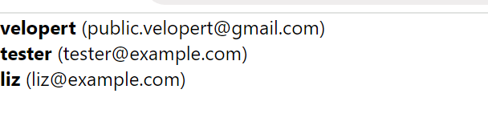

## 11. 배열 랜더링하기

리액트에서 배열을 랜더링하는 방법을 알아보자.
밑의 배열이 있다고 가정해보자.
```
const users = [
  {
    id: 1,
    username: 'velopert',
    email: 'public.velopert@gmail.com'
  },
  {
    id: 2,
    username: 'tester',
    email: 'tester@example.com'
  },
  {
    id: 3,
    username: 'liz',
    email: 'liz@example.com'
  }
];
```
이 배열을 컴포넌트로 랜더링하려면, 가장 기본적인 방법으로는 그대로 코드를 작성하는 것이다.
UserList..jsx 파일을 만들어서 밑의 컴포넌트를 작성해보자.
```
function UserList() {
  const users = [
    {
      id: 1,
      username: 'velopert',
      email: 'public.velopert@gmail.com'
    },
    {
      id: 2,
      username: 'tester',
      email: 'tester@example.com'
    },
    {
      id: 3,
      username: 'liz',
      email: 'liz@example.com'
    }
  ];
  return (
    <div>
      <div>
        <b>{users[0].username}</b> <span>({users[0].email})</span>
      </div>
      <div>
        <b>{users[1].username}</b> <span>({users[1].email})</span>
      </div>
      <div>
        <b>{users[2].username}</b> <span>({users[1].email})</span>
      </div>
    </div>
  );
}
```
재사용 되는 코드를 일일히 넣는게 좋지 않으니, 컴포넌트를 재사용할 수 있도록 새로 만들어보자.
***한 파일에 여러개의 컴포넌트를 선언해도 괜찮다***
```
function User({ user }) {
  return (
    <div>
      <b>{user.username}</b> <span>({user.email})</span>
    </div>
  );
}

function UserList() {
  const users = [
    {
      id: 1,
      username: 'velopert',
      email: 'public.velopert@gmail.com'
    },
    {
      id: 2,
      username: 'tester',
      email: 'tester@example.com'
    },
    {
      id: 3,
      username: 'liz',
      email: 'liz@example.com'
    }
  ];

  return (
    <div>
      <User user={users[0]} />
      <User user={users[1]} />
      <User user={users[2]} />
    </div>
  );
}
```
이제 컴포넌트를 랜더링 해보자



배열이 고정적이라면 상관없겟지만, 배열의 인덱스를 하나하나 조회해가면서 렌더링하는 방법은 동적인 배열을 렌더링하지 못한다.

동적인 배열을 렌더링해야 할 때에는 자바스크립트 배열의 내장함수 map() 을 사용해야한다.

map() 함수는 배열안에 있는 각 원소를 변환하여 새로운 배열을 만들어주는 역할을 한다. 리액트에서 동적인 배열을 렌더링해야 할 때는 이 함수를 사용하여 일반 데이터 배열을 리액트 엘리먼트로 이루어진 배열로 변환해주면 된다.
UserList 컴포넌트를 밑의 코드처럼 수정해보자.
```
function UserList() {
    const users = [
        {
            id: 1,
            username: 'velopert',
            email: 'public.velopert@gmail.com'
        },
        {
            id: 2,
            username: 'tester',
            email: 'tester@example.com'
        },
        {
            id: 3,
            username: 'liz',
            email: 'liz@example.com'
        },
    ]

    return (
        <div>
            {users.map((user) => (
                <User user={user} key={user.id} />
            ))}
        </div>
    )
}
```
이렇게 map 함수를 사용해주면 배열의 모든 원소가 렌더링된다.

<br/>
<br/>

## key 의 존재유무에 따른 업데이트 방식

예를 들어서 다음과 같은 배열이 있다고 가정해보자
```
const array = ['a', 'b', 'c', 'd'];
```
그리고 위 배열을 다음과 같이 랜더링한다고 가정해보자.
```
array.map(item => <div>{item}</div>);
```
위 배열의 b 와 c 사이에 z 를 삽입하게 된다면, 리렌더링을 하게 될 때 `<div>b</div>` 와 `<div>c</div>` 사이에 새 div 태그를 삽입을 하게 되는 것이 아니라, 기존의 c 가 z 로바뀌고, d 는 c 로 바뀌고, 맨 마지막에 d 가 새로 삽입된다.

그 다음에 a 를 제거하게 된다면, 기존의 a 가 b 로 바뀌고, b 는 z 로 바뀌고, z는 c로 바뀌고, c는 d 로바뀌고, 맨 마지막에 있는 d 가 제거된다.

<br/>
<br/>

비효율적인 것을 확인할 수 있다.  -->  하지만 `key` 가 있다면 이 작업은 개선된다.
```
[
  {
    id: 0,
    text: 'a'
  },
  {
    id: 1,
    text: 'b'
  },
  {
    id: 2,
    text: 'c'
  },
  {
    id: 3,
    text: 'd'
  }
];
```
객체에 다음과 같이 `key` 로 사용할 수 있는 고유 값이 있고 다음과 같이 랜더링이 된다면,
```
array.map(item => <div key={item.id}>{item.text}</div>);
```
배열이 업데이트 될 때 key 가 없을 때 처럼 비효율적으로 업데이트 하는 것이 아니라, 수정되지 않는 기존의 값은 그대로 두고 원하는 곳에 내용을 삽입하거나 삭제한다.

때문에, 배열을 렌더링 할 때에는 고유한 key 값이 있는것이 중요하며, 만약에 배열안에 중복되는 key 가 있을 때에는 렌더링시에 오류메시지가 콘솔에 나타나게 되며, 업데이트가 제대로 이루어지지 않게 된다.